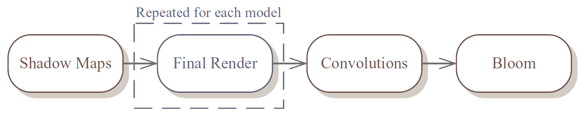
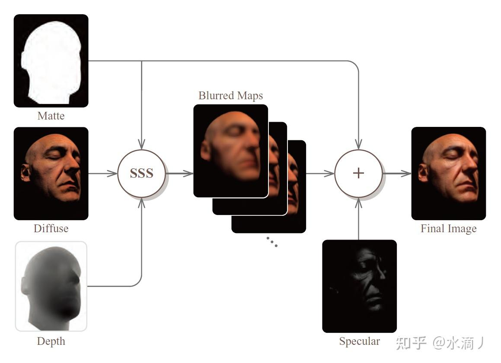
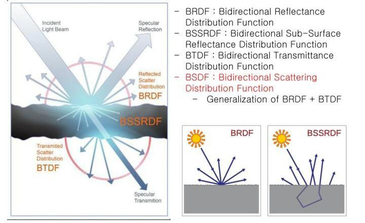

# HDRP中的Subsurface Scattering https://zhuanlan.zhihu.com/p/450046635
在次表面散射Command中主要有两个绘制操作，一个是使用CS计算次表面散射，一个是将散射结果和前向照明混合，这里可以根据图形流水线的特点从下向上追本溯源。

# URPScreenSpaceSSS

思路：1.完成物体材质着色器   2.后处理代码 和后处理着色器

前言：
BRDF、BSSRDF、BTDF、BSDF的关系

如上图，光线从一种介质射向另外一种介质时，有反射，次表面散射、透射三种交互形态：
其普通反射的行为用BRDF描述
其次表现散射的行为用 BSSRDF描述
其透射的行为用BTDF描述

四者的联系：
总体来说，BRDF 为 BSSRDF 的一种简化
BSDF可分为反射和透射分量两部分，即BSDF = BRDF + BTDF

skin的组成由 镜面反射+次表面散射组成

1.（镜面反射）specular可以用 Kelemen and Szirmay-Kalos specular BRDF 模拟镜面反射效果
2.（透射）Transmittance
BSSRDF（Bidirectional Surface Scattering Reflectance Distribution Function，双向表面散射反射分布函数）是目前的主流技术。简单来说，传统的 BRDF 模型是 BSSRDF的一种简化。BSSRDF和BRDF的不同之处在于，BSSRDF可以指定不同的光线入射位置和出射的位置。

# URPSeparableSSS

